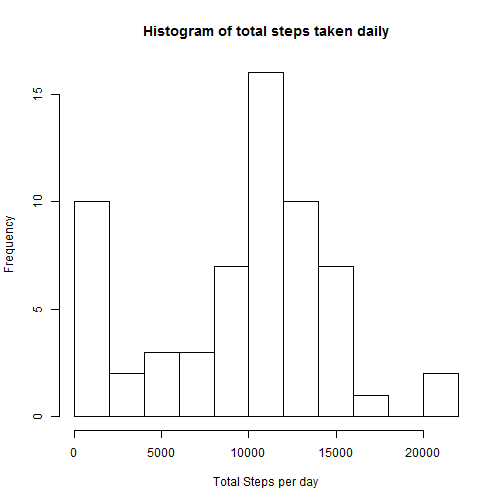
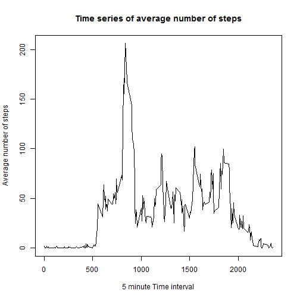
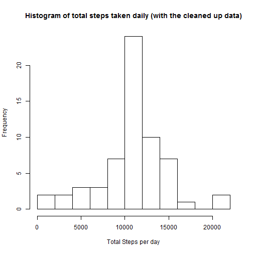
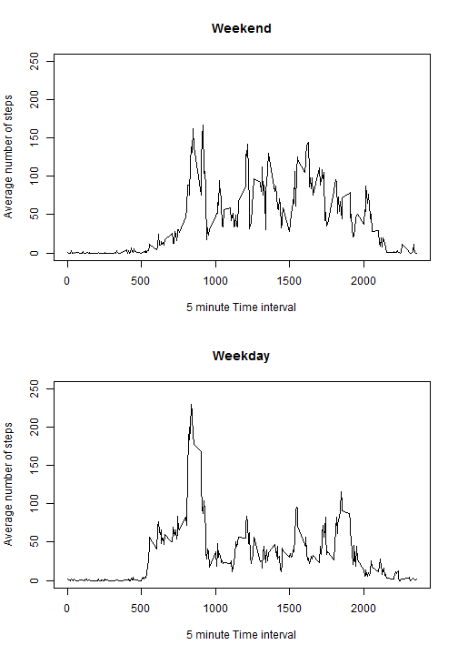

Reproducible Research - Assignment 1
====================================
This analysis is based on the fitness data recorded over 5 minute intervals.

Read and take a look at the data

```r
library(data.table)
setwd("C:\\Users\\mvishnubhatta\\Documents\\data")
data <- read.csv("activity.csv", header=TRUE, sep=",", na.strings="NA")
```

Now draw a histogram

```r
dt <- data.table(data)
#sum up the steps
gdt <- dt[,list(totalsteps=sum(steps, na.rm = TRUE)),by=date]

#Draw a histogram based on these sums
hist(gdt$totalsteps, breaks = 10, main = "Histogram of total steps taken daily", xlab = "Total Steps per day")
```

```
## Warning in par("page"): "page" is not a graphical parameter
```

```
## Warning in plot_snapshot(incomplete_plots): Please upgrade R to at least
## version 3.0.2
```

 

The mean and median of the number of steps per day is:

```r
mean(gdt$totalsteps,na.rm=TRUE)
```

```
## [1] 9354.23
```

```r
median(gdt$totalsteps,na.rm=TRUE)
```

```
## [1] 10395
```

You can see below the time series plot of the average number of steps per timer interval, against the 5 minute time intervals


```r
#Build a data set with mean values
gdt_ts <- dt[,list(avgsteps=mean(steps, na.rm = TRUE)),by=interval]

#Now draw a time series plot
plot(as.numeric(gdt_ts$interval), gdt_ts$avgsteps, type = "l", xlab = "5 minute Time interval", ylab = "Average number of steps", main = "Time series of average number of steps")
```

```
## Warning in par("page"): "page" is not a graphical parameter
```

```
## Warning in plot_snapshot(incomplete_plots): Please upgrade R to at least
## version 3.0.2
```

```r
head(gdt_ts)
```

```
##    interval  avgsteps
## 1:        0 1.7169811
## 2:        5 0.3396226
## 3:       10 0.1320755
## 4:       15 0.1509434
## 5:       20 0.0754717
## 6:       25 2.0943396
```

 

Now report the interval with the max average steps

```r
gdt_ts$interval[which.max(gdt_ts$avgsteps)]
```

```
## [1] 835
```

There are a number of records with NAs in the input data.

```r
nrow(dt[is.na(dt$steps),])
```

```
## [1] 2304
```

Let us replace the NAs now. The strategy is to replace it with the mean of that particular interval across all the non-NA data that we calculated earlier.

```r
#Merge the data with the interval wise mean
merge_res <- merge(dt,gdt_ts,by = "interval")

#Sort the Raw data and the merged data
sdt <- dt[order(date, interval)]
smerge_res <- merge_res[order(date,interval)]

#Now find which values are NA and replace them with average steps
na.idx <- which(is.na(sdt$steps))
sdt$steps[na.idx] <- smerge_res$avgsteps[na.idx]
```

Now there should not be any NAs

```r
nrow(sdt[is.na(sdt$steps),])
```

```
## [1] 0
```

With the new data set, build a histogram again.

```r
gsdt <- sdt[,list(totalsteps=sum(steps)),by=date]
hist(gsdt$totalsteps, breaks = 10, main = "Histogram of total steps taken daily (with the cleaned up data)", xlab = "Total Steps per day")
```

```
## Warning in par("page"): "page" is not a graphical parameter
```

```
## Warning in plot_snapshot(incomplete_plots): Please upgrade R to at least
## version 3.0.2
```

 

When compared with the earlier histogram, it can be seen that not filling in NAs led to an increase in number of time intervals having 0 steps (because they had NAs). When we fill in with NAs, the data appears more reasonable.


Now add a column with the weekend flag.

```r
wknd <- function(input)
{
        if ((weekdays(as.Date(input)) == 'Saturday') | (weekdays(as.Date(input)) == 'Sunday'))
	{return ('Weekend')}
	else 
	{return ('Weekday')}
}
sdt$wkndflg <- sapply(sdt$date,wknd)
```

Now draw the panel plot


```r
par(mfrow=c(2,1))

#split the data into week days and weekends
wkdaydata <- subset(sdt, wkndflg == 'Weekday')
wknddata <- subset(sdt, wkndflg == 'Weekend')

#Find the average over weekday or weekend
wkdaydata_ts <- wkdaydata[,list(avgsteps=mean(steps, na.rm = TRUE)),by=interval]
wknddata_ts <- wknddata[,list(avgsteps=mean(steps, na.rm = TRUE)),by=interval]

#Draw The plots
plot(as.numeric(wknddata_ts$interval), wknddata_ts$avgsteps, type = "l", xlab = "5 minute Time interval", ylab = "Average number of steps", main = "Weekend", ylim = c(0,250))
```

```
## Warning in par("page"): "page" is not a graphical parameter
```

```
## Warning in plot_snapshot(incomplete_plots): Please upgrade R to at least
## version 3.0.2
```

```r
plot(as.numeric(wkdaydata_ts$interval), wkdaydata_ts$avgsteps, type = "l", xlab = "5 minute Time interval", ylab = "Average number of steps", main = "Weekday", ylim = c(0,250))
```

```
## Warning in par("page"): "page" is not a graphical parameter
```

```
## Warning in plot_snapshot(incomplete_plots): Please upgrade R to at least
## version 3.0.2
```

 


